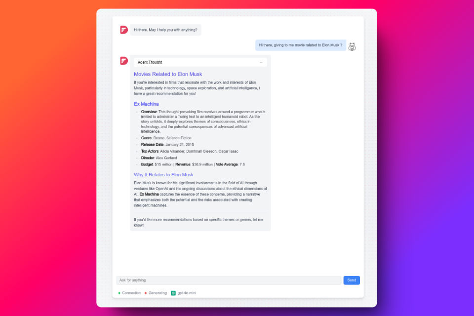
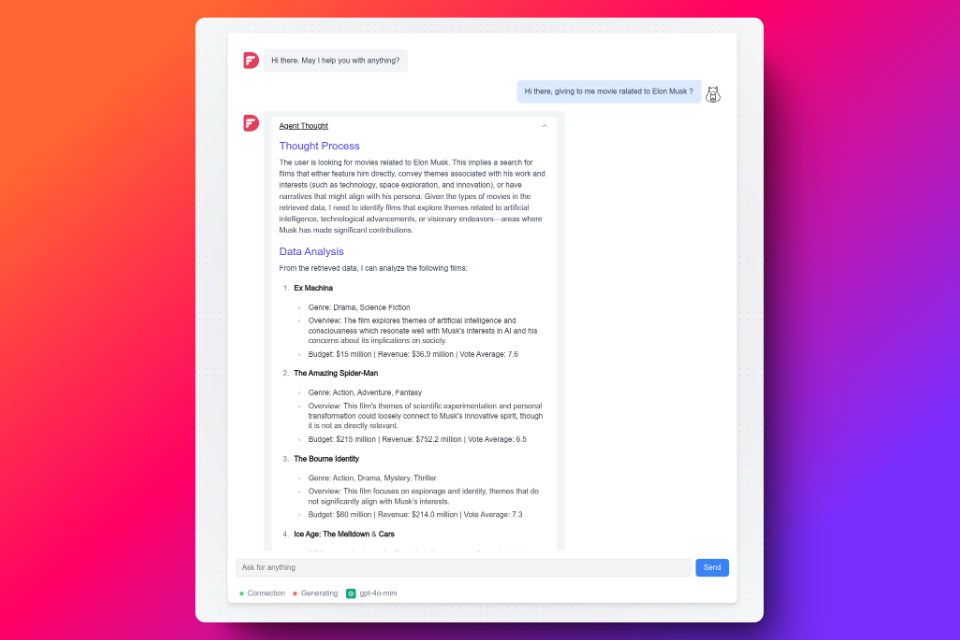
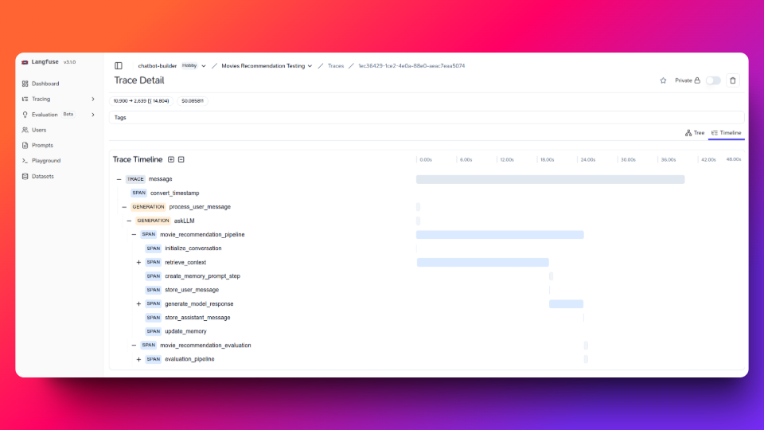

# Movies Recommender

## Project Overview

Movies Recommender is an intelligent, LLM-powered movie recommendation system that leverages advanced machine learning techniques to provide personalized movie suggestions through a natural language interface. Datasets **tmdb_5000_credits** and **tmdb_5000_movies**

## Technical Architecture

### Components
- **Frontend**: Next.js React Application
- **Backend**: Python FastAPI Service
- **Database**: PostgreSQL with pgvector
- **Observability**: LangFuse

### Key Technologies
- Frontend: TypeScript, Next.js, React
- Backend: Python, FastAPI, SQLAlchemy, LangChain, LangFuse
- LLM: LLM Models
- Database: PostgreSQL, pgvector
- Authentication: OAuth 2.0

## Getting Started

### Prerequisites
- Docker
- Docker Compose
- Make

### Installation

1. Clone the repository
```bash
git clone https://github.com/yourusername/movies-recommender.git
cd movies-recommender
```

2. Start the application
```bash
make up
```

### Preview application

The system can be modeled as a **recommendation funnel** with several key components that can be represented mathematically:

**User Interface Flow**
Let's represent this as a commutative diagram:

$$
\begin{CD}
\text{User-Input} @>>> \text{Embbeding Token} @>>> \text{Query-Vector} \\
@VVV @VVV @VVV \\
\text{Context-Memory} @>>> \text{Recommendation-Engine} @>>> \text{Movie-Suggestions} \\
@VVV @VVV @VVV \\
\text{Evaluation} @>>> \text{Collect-Data} @>>> \text{Model-Update}
\end{CD}
$$

**System Architecture Components**
The relationship between components can be expressed as:

$$
\text{System} = \{F, B, D, L\}
$$

Where:
- $F$: Frontend (Next.js)
- $B$: Backend (FastAPI)
- $D$: Database (PostgreSQL)
- $L$: LLM Components





**Mathematical Structure Analysis**
The timeline can be represented as a directed acyclic graph (DAG) with the following properties:


$$
\begin{aligned}
\text{Timeline} &= (V, E, T) \\
\text{where:} & \\
V &= \text{Set of spans/operations} \\
E &= \text{Dependencies between operations} \\
T &= \text{Temporal mapping function}
\end{aligned}
$$

**Key Components and Relationships**
Let's create a commutative diagram showing the flow of operations:

$$
\begin{CD}
\text{Message} @>>> \text{Process-User-Message} @>>> \text{AskLLM} \\
@VVV @VVV @VVV \\
\text{Movie-Recommendation} @>>> \text{Initiate-Conversation} @>>> \text{Retrieve-Context} \\
@VVV @VVV @VVV \\
\text{Generate-Response} @>>> \text{Store-Assistant-Message} @>>> \text{Evaluation-Pipeline}
\end{CD}
$$


**Key Observations**

1. The system implements a **hierarchical execution model**
2. The trace exhibits **nested parallelism** in some operations
3. The system follows a **pipeline architecture** pattern

This trace visualization provides valuable insights into the execution flow and performance characteristics of what appears to be a movie recommendation system built with LangChain.




## Development

### Project Structure
```
movies-recommender/
├── recommender-be/   # Backend Python Service
├── recommender-ui/   # Frontend Next.js Application
└── .context/         # Project Context Documentation
```

### Documentation
Detailed project documentation is available in the `.context` directory, including:
- Project overview
- Development guidelines
- Architecture diagrams

## Contributing

1. Read the development guidelines in `.context/docs.md`
2. Follow the coding standards
3. Submit pull requests with clear descriptions
